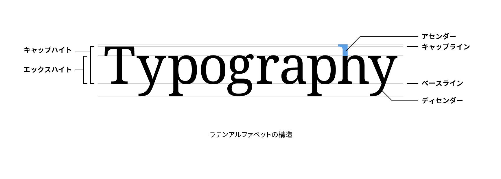

# アセンダー

アセンダー（ascender）はアルファベットの小文字「b」、「d」、「f」、「k」、「l」のエックスハイトより上に出ている部分のことです。アセンダーの上端が接する仮想のラインをアセンダーライン（ascender line）といいます。多くの書体でアセンダーラインはキャップラインより少し高くなります。

## 関連項目

- [ベースライン](./baseline.md)
- [キャップハイト](./cap-height.md)
- [エックスハイト](./x-height.md)
- [ディセンダー](./descender.md)
- [カウンター](./counter.md)
