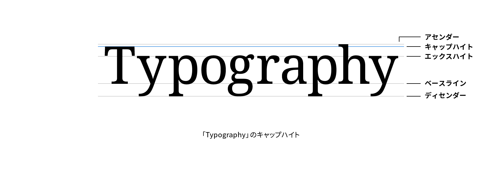

# キャップハイト

キャップハイト（cap height）はアルファベットの大文字のベースラインから文字の上端までの高さをいいます。キャピタルハイト（capital height）とも呼ばれます。キャップハイトの上端が接する仮想のラインをキャップライン（cap line）といいます。

## 関連項目

- [ベースライン](./baseline.md)
- [エックスハイト](./x-height.md)
- [アセンダー](./ascender.md)
- [ディセンダー](./descender.md)
- [カウンター](./counter.md)
