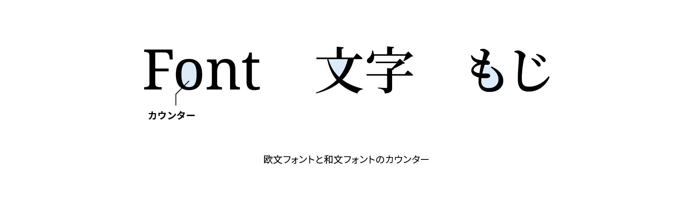

# カウンター

カウンター（counter）は文字内の線に囲まれた空間のことです。カウンターの広さは書体の印象や読みやすさに影響します。日本語の場合は「ふところ」と呼ばれます。

## 関連項目

- [ベースライン](./baseline.md)
- [キャップハイト](./cap-height.md)
- [エックスハイト](./x-height.md)
- [アセンダー](./ascender.md)
- [ディセンダー](./descender.md)
