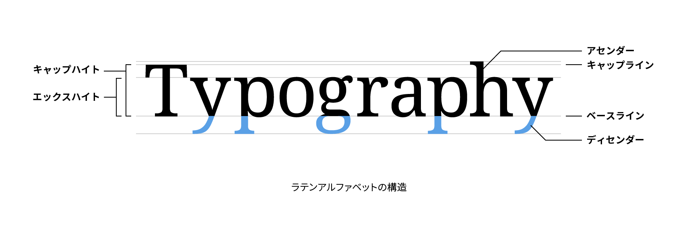

# ディセンダー

ディセンダー（descender）はアルファベットの小文字「g」、「j」、「p」、「q」、「y」のベースラインより下に出ている部分のことです。ディセンダーの下端が接する仮想のラインをディセンダーライン（descender line）といいます。

## 関連項目

- [ベースライン](./baseline.md)
- [キャップハイト](./cap-height.md)
- [エックスハイト](./x-height.md)
- [アセンダー](./ascender.md)
- [カウンター](./counter.md)
