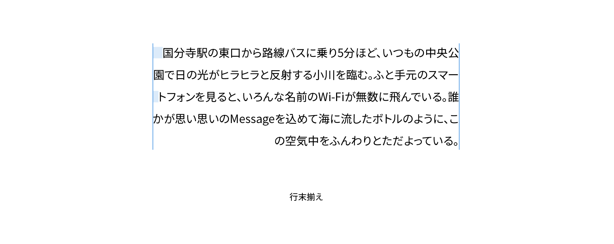

# 行末揃え

行頭揃え（flush right）は行揃えの方法のひとつで、各行の文字列を行末で揃えるものです。文字列の長さが行の長さに満たない場合は行頭側に空きができるため、段落全体では行頭が不揃いになります。



## 実践

CSSで行末揃えにするには、`text-align`プロパティで`right`を指定します。縦書きの場合も同様です。

```css
p {
  text-align: right;
}
```

なお、`letter-spacing`プロパティで0以外の数値を指定している場合、各文字のボディの右側（縦書きでは下側）のスペースが調整されるため、行末が行を含むブロックの右辺（縦書きでは下辺）とぴったり合わなくなります。これを解消するには要素の`margin-right`プロパティで相殺する必要があります。

```css
p {
  text-align: right;
  letter-spacing: 0.1em;
  margin-right: -0.1em;
}
```

## 関連項目

- [行揃え](./text-alignment.md)
- [行頭揃え](./flush-left.md)
- [中央揃え](./centered.md)
- [両端揃え](./justified.md)
