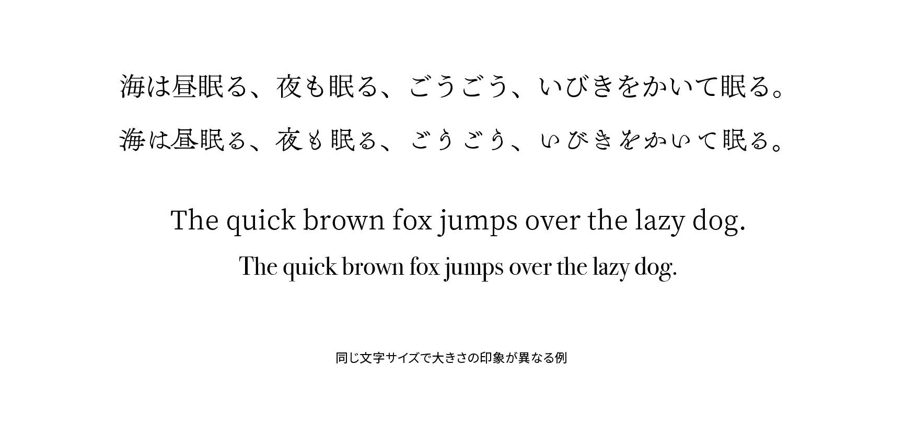

# 文字サイズ

文字サイズ（font size）はフォントのボディの大きさのことです。字面のサイズを指すものではないため、同じ文字サイズでも書体によって大きさの印象が異なる場合があります。



## 実践

CSSで文字サイズを指定するには`font-size`プロパティを利用します。値には`em`・`rem`・`ex`・`px`など単位つきの数値のほか、パーセンテージ（`%`）、`medium`・`small`・`x-large`などの絶対キーワード、`smaller`と`larger`という相対キーワードも使えます。

```css
html {
  font-size: 112.5%;
}

h1 {
  font-size: 2rem;
}

small {
  font-size: 0.8em;
}
```

## 関連項目

- [ボディ](./body.md)
- [字面](./face.md)
