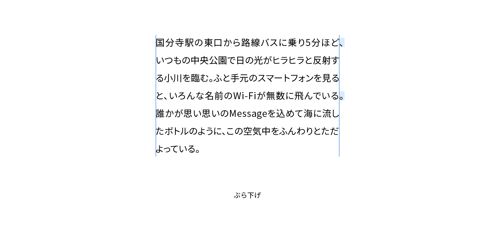

# ぶら下げ

ぶら下げ（またはぶら下がり、hanging punctuation）は、行頭・行末で句読点などの約物をテキストブロックの外側に飛び出させて配置することをいいます。欧文では引用符やハイフンなどもぶら下げの対象になりますが、日本語でぶら下げ処理をするのは原則として行末の句読点のみです。



## 実践

CSSではぶら下げをコントロールするプロパティとして`hanging-punctuation`があります。日本語で行末の句読点のぶら下げを許容するには、値に`allow-end`を指定します。

```css
article {
  hanging-punctuation: allow-end;
}
```

## 関連項目

- [禁則](./line-breaking-rules.md)

## 参考資料

- [hanging-punctuation - CSS: カスケーディングスタイルシート | MDN](https://developer.mozilla.org/ja/docs/Web/CSS/hanging-punctuation)
