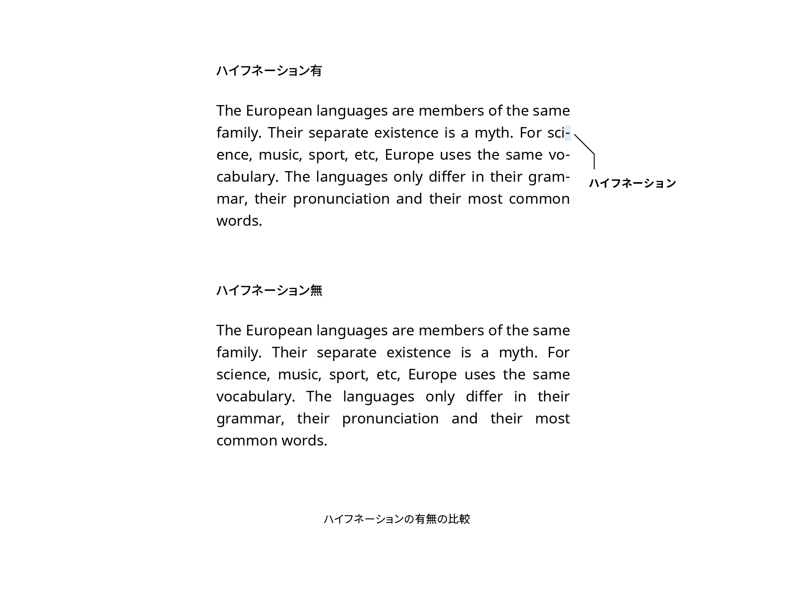

# ハイフネーション

ハイフネーション（hyphenation）は欧文で行が折り返されるときに、単語をハイフンで分割することをいいます。



## 実践

CSSでハイフネーションをコントロールするには`hyphens`プロパティを使います。初期値は`manual`で、HTMLでハイフン（U+2010）またはソフトハイフン（U+00AD）のある箇所でのみハイフネーションが可能になります。

```html
hyphen&shy;ation
```

しかしすべてのハイフネーション可能箇所に手動でソフトハイフンを挿入するのは現実的ではありません。そこで`hyphens`プロパティに`auto`を指定すると、言語に応じたハイフネーションが自動的に適用されます。このときの振る舞いは言語に依存するため、HTMLの`lang`属性が適切に指定されている必要があります。

```css
article p {
  hyphens: auto;
}
```

## 関連項目

- [行揃え](./text-alignment.md)

## 参考資料

- [ソフトハイフン - Wikipedia](https://ja.wikipedia.org/wiki/%E3%82%BD%E3%83%95%E3%83%88%E3%83%8F%E3%82%A4%E3%83%95%E3%83%B3)
- [hyphens - CSS: カスケーディングスタイルシート | MDN](https://developer.mozilla.org/ja/docs/Web/CSS/hyphens)
