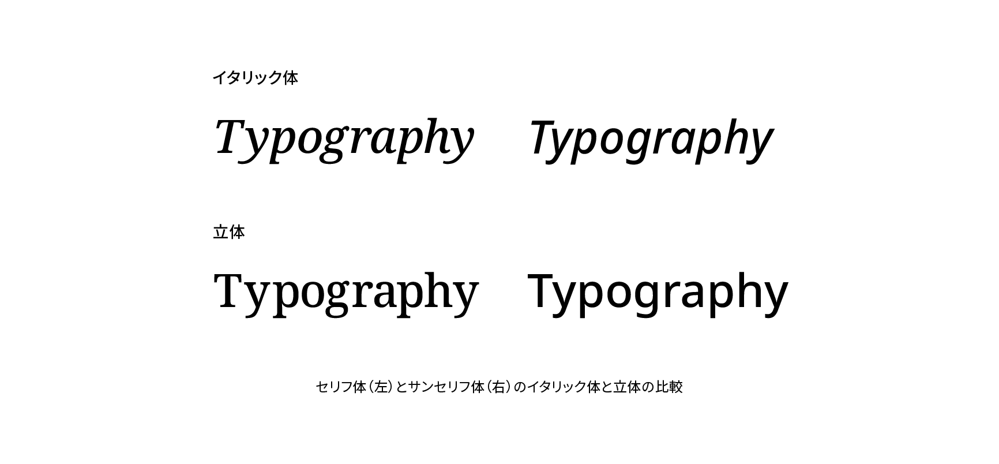
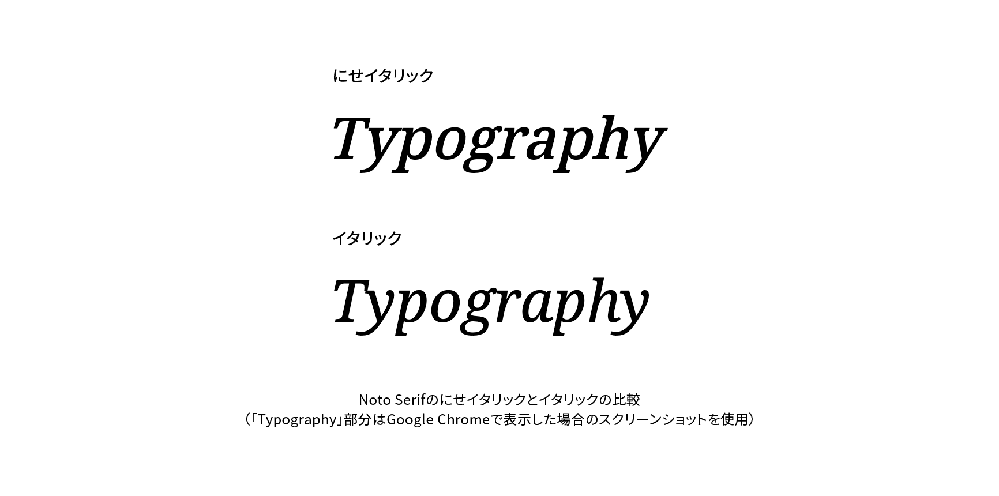

# イタリック体

イタリック体（italic）は欧文書体のスタイルのひとつで、筆記体風の傾いた字形が特徴です。字形はローマン体（まっすぐに立った書体）を単にそのまま傾けたものではなく、独自の形にデザインされています。またイタリック体のように独自の形を持たず、ローマン体を傾ける形でデザインされた書体をオブリーク体（obluque）と呼ぶこともありますが、オブリーク体も含む傾斜書体をイタリック体と総称することが多いようです。イタリック体は欧文固有のスタイルで、一般に日本のグリフには相当するスタイルがありません。



## 用法

欧文では、強調や、作品のタイトル、外国語などをイタリック体で表現することがあります。

## 実践

Webでイタリック体を利用する場合は、CSSで`font-family`プロパティの値に`italic`を指定します。

```css
.Quote {
  font-family: italic;
}
```

## 発展

イタリック体を利用しようと思っても、ファミリーがイタリック体を持っていなかったり、Webフォントでイタリック体がダウンロードされていなかったりすることがあります。そういった場合にCSSでイタリックを指定すると、ブラウザーはローマン体のフォントを機械的に傾けて擬似的なイタリック体として表示します。しかし前述の通り、本来イタリック体はローマン体をただ傾けたものではなく、異なる字形として独自にデザインされたものです。そのためブラウザーによる擬似的なイタリックは「にせイタリック（faux italic）」などと呼ばれます。にせイタリックは本来の適切にデザインされた形ではないため、読みづらく、不格好なものになりがちです。イタリック体で表示するときは、ファミリーにイタリック体が含まれることを確認しましょう。



また、日本語書体をCSSによって傾けることも可能ですが、欧文の「にせイタリック」同様、ブラウザーによる機械的な処理であり、書体デザイナーが意図したデザインではない点に注意が必要です。

## 関連項目

- [ローマン体](./roman.md)
- [ウェイト](./weight.md)

## 参考資料

- 小林章『欧文書体　その背景と使い方』美術出版社、2005
- Theo Rosendorf, <cite>The Typographic Desk Reference</cite>. Oak Knoll Press, 2016
- 髙岡昌生『増補改訂版　欧文組版　タイポグラフィの基礎とマナー』美術出版社、2019
- [Say No to Faux Bold · An A List Apart Article](https://alistapart.com/article/say-no-to-faux-bold)
