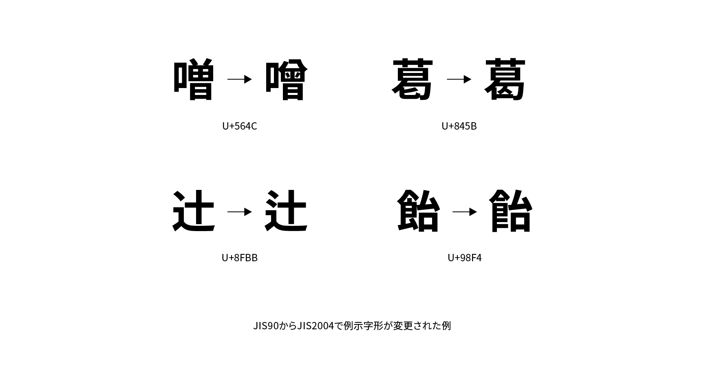

# JIS2004

JIS2004（ジスにせんよん）は「JIS X 0123:2004」の通称で、日本語の符号化文字集合（文字セット）の規格JIS X 0213を2004年に改正したものです。

日本工業規格（JIS）で定められた符号化文字集合の規格には各文字の「例示字形」が記載されていますが、JIS2004ではそれ以前のJIS90（JIS X 0208:1990）から168字に変更が加えられました。例示字形はフォントのグリフを規定するものではありませんが、事実上の標準とも見なされており、日本語フォントに大きな影響を与えます。

それまでJIS90の例示字形に準拠していたフォントがJIS2004に対応する際、そのままフォント名を変えずにアップデートした例もありますが、多くのフォントは混乱を避けるために名前を変えた別フォントとしてリリースされました。フォント名にStdNやProNなど「N」とついているものがそうです。たとえばヒラギノ明朝ProはJIS90、ヒラギノ明朝ProNはJIS2004にそれぞれ準拠しています。

## 関連項目

- [字体](./jitai.md)
- [字形](./jikei.md)
- [異体字](./itaiji.md)
- [グリフ](./glyph.md)
- [文字コード](,/character-encoding.md)
- [Adobe-Japan1](./adobe-japan1.md)

## 参考資料

- 矢野啓介『［改訂新版］プログラマのための文字コード技術入門』技術評論社、2019
- ものかの「日本語オープンタイプフォーマットの基本」、『+DESIGNING VOLUME 44』マイナビ出版、2017
- [JIS90字形とJIS2004字形 - フォント専門サイト fontnavi](https://fontnavi.jp/zakkuri/304-jis2004_jis90.aspx)
