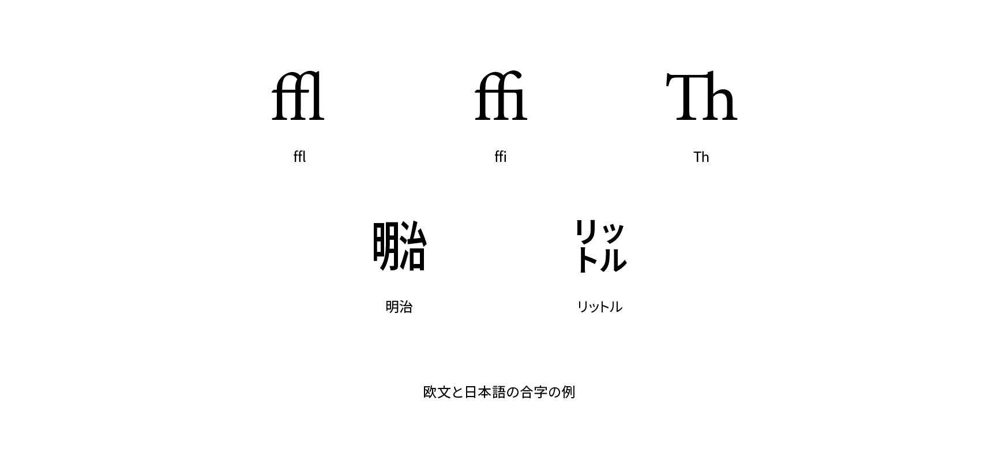

# 合字（リガチャー）

合字、またはリガチャー（ligature）は複数の文字がつながってデザインされたグリフです。どの合字が用意されているかはフォントによって異なりますが、欧文の「ffl」や「ffi」、「Th」などが合字の対象になります。また、日本語の「㍾」、「㍑」といったグリフも合字と呼ばれます。



## 実践

CSSで欧文の合字を有効にするには`font-feature-settings`プロパティの値に`"liga"`を指定しますが、通常はデフォルトで有効になっているため指定する必要はありません。合字をあえて無効にしたいときは`"liga" 0`を指定します。

```css
p {
  font-feature-settings: "liga" 0;
}
```

## 関連項目

- [イタリック体](./italic.md)
- [スモールキャップ](./small-caps.md)
