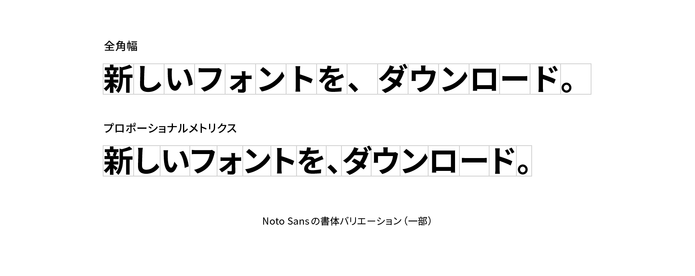

# プロポーショナルメトリクス

プロポーショナルメトリクス（proportional metrics）はOpenType機能のひとつで、全角でデザインされたグリフのボディ幅を、個々の字形に合わせたプロポーショナルな幅に変更するものです。ブラウザなどのアプリケーションでプロポーショナルメトリクスを有効にするには、フォントがプロポーショナルメトリクスの情報を持っていることと、アプリケーションがOpenType機能に対応していることが必要となります。

<figure>
    
</figure>


プロポーショナルメトリクスは全角のボディ幅をプロポーショナル幅に変更する機能であり、字間を調整するものではありません。特定の文字の組み合わせに応じて字間を調整するカーニングや、ひとまとまりのテキストの字間を均等に調整するトラッキングとは異なるので注意が必要です。また多くの場合、プロポーショナルメトリクスを有効にした場合は同時にカーニングも有効にします。

## 用法

プロポーショナルメトリクスを有効にすると、文字の間隔が詰まり、テキストが引き締まった印象になります。そのため見出しやリード文など、短く、文字サイズの大きいテキストで効果的なことがあります。しかし一方で、全角の日本語フォントが持っている本来のリズムとは異なる文字の配置になるため、使い方によっては読みやすさを損ねてしまう場合もあります。とくに長文や、小さな文字サイズでの採用は慎重になるべきでしょう。

## 実践

CSSでプロポーショナルメトリクスを有効にするには`font-feature-settings`プロパティの値に`"palt"`を指定します。またカーニングを有効にするため`font-kerning`プロパティも合わせて指定するとよいでしょう。

```css
h1 {
  font-feature-settings: "palt";
  font-kerning: normal;
}
```

## 関連項目

- [全角](./fullwidth.md)
- [カーニング](./kerning.md)
- [トラッキング](./tracking.md)

## 参考文献

- [【真夜中のOpenTypeフィーチャー講座】プロポーショナルメトリクスと自動カーニング - Togetter](https://togetter.com/li/1083953)
- [CSSでのOpenType機能の構文 - Adobe Help Center](https://helpx.adobe.com/jp/fonts/using/open-type-syntax.html#palt)
