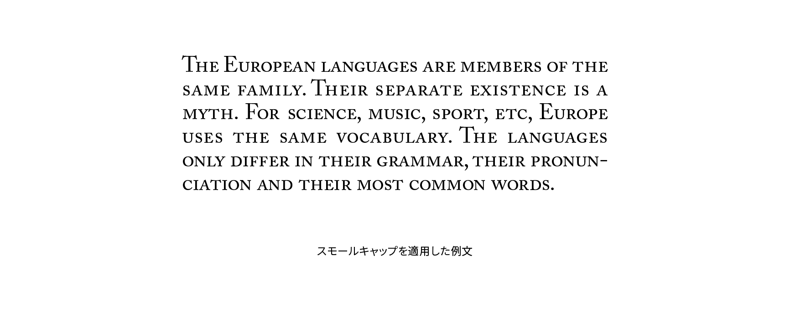

# スモールキャップ

スモールキャップ（small caps）またはスモールキャピタル（small capitals）は、欧文アルファベットの大文字を小文字のエックスハイト程度に小さくデザインしたグリフをいいます。頭字語などで使われます。スモールキャップは大文字をただ縮小したものではなく、太さや形がほかのアルファベットと調和するようデザインされています。スモールキャップを持っていないフォントもあります。



## 実践

CSSでスモールキャップを使うには`font-variant-caps`プロパティに`small-caps`を指定します。初期値は`normal`で、スモールキャップが無効になっています。

```css
abbr {
  font-variant-caps: small-caps;
}
```

## 関連項目

- [イタリック体](./italic.md)
- [合字（リガチャー）](./ligature.md)
- [エックスハイト](./x-height.md)
