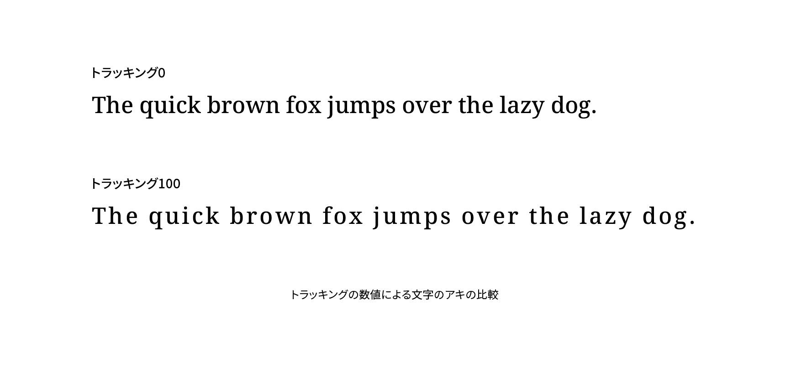

# トラッキング

トラッキング（tracking）は、ひとまとまりのテキストの字間を均等に空けたり詰めたりして調整することです。なお、特定の組み合わせの字間を調整することはカーニングといいます。



## 実践

CSSでトラッキングをするには`letter-spacing`プロパティを使います。プラス値で字間が広がり、マイナス値で狭まります。文字サイズに対する相対値である`em`単位を使うのが初期値は`normal`で、その場合は字間が0、つまりベタ組みになります。

```css
.PrimaryNav {
  letter-spacing: 0.1em;
}

.ArticleTitle {
  letter-spacing: -0.05em;
}
```

たとえば、欧文の大文字だけで構成されたテキストは字間を少し空けると読みやすくなることがあります。また、見出しなど大きな文字サイズで字間が空いて見える場合はマイナス値を指定して調整するとよいでしょう。ただし、文字が重なってしまわないよう注意が必要です。

## 関連項目

- [字間](./letter-space.md)
- [カーニング](./kerning.md)
- [ベタ組み](./betagumi.md)
