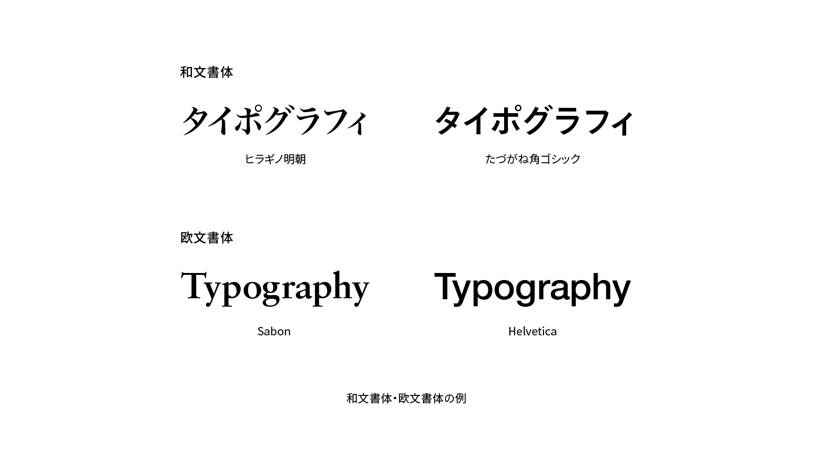

# 書体

書体（typeface）は、一定の様式でデザインされた字形の集合のことをいいます。たとえばHelveticaやヒラギノ明朝体などです。書体の分類として、和文の明朝体やゴシック体、欧文のセリフ体やサンセリフ体などがあります。

## 関連項目

- [フォント](./font.md)
- [ファミリー](./family.md)
- [明朝体](./mincho-typeface.md)
- [ゴシック体](./gothic.md)
- [セリフ体](./serif.md)
- [サンセリフ体](./sans-serif.md)
- [等幅フォント](./monospaced-font.md)
