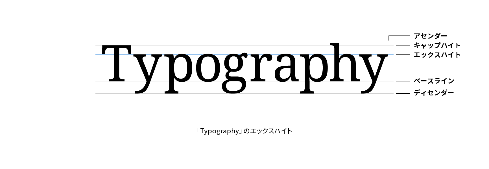

# エックスハイト

エックスハイト（x-height）は、xなどアセンダーを持たないアルファベットの小文字の、ベースラインから文字の上端までの高さをいいます。



## 実践

CSSではエックスハイトを基準にした単位`ex`が利用できます。1exがエックスハイトと等しくなります。

```css
p {
  line-height: 4ex;
}
```

## 関連項目

- [ベースライン](./baseline.md)
- [キャップハイト](./cap-height.md)
- [アセンダー](./ascender.md)
- [ディセンダー](./descender.md)
- [カウンター](./counter.md)
